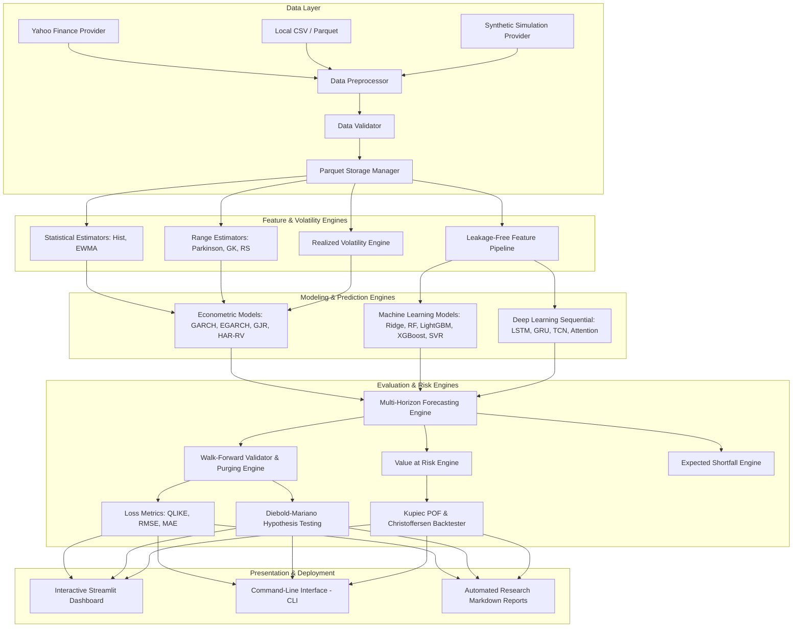

# System Architecture & Component Interaction

```mermaid
flowchart TD
    subgraph Data Layer
        A1[Yahoo Finance Provider] --> B[Data Preprocessor]
        A2[Local CSV / Parquet] --> B
        A3[Synthetic Simulation Provider] --> B
        B --> C[Data Validator]
        C --> D[Parquet Storage Manager]
    end

    subgraph Feature & Volatility Engines
        D --> E1[Statistical Estimators: Hist, EWMA]
        D --> E2[Range Estimators: Parkinson, GK, RS]
        D --> E3[Realized Volatility Engine]
        D --> F[Leakage-Free Feature Pipeline]
    end

    subgraph Modeling & Prediction Engines
        E1 & E2 & E3 --> G1[Econometric Models: GARCH, EGARCH, GJR, HAR-RV]
        F --> G2[Machine Learning Models: Ridge, RF, LightGBM, XGBoost, SVR]
        F --> G3[Deep Learning Sequential: LSTM, GRU, TCN, Attention]
    end

    subgraph Evaluation & Risk Engines
        G1 & G2 & G3 --> H1[Multi-Horizon Forecasting Engine]
        H1 --> H2[Walk-Forward Validator & Purging Engine]
        H2 --> I1[Loss Metrics: QLIKE, RMSE, MAE]
        H2 --> I2[Diebold-Mariano Hypothesis Testing]
        H1 --> J1[Value at Risk Engine]
        H1 --> J2[Expected Shortfall Engine]
        J1 --> J3[Kupiec POF & Christoffersen Backtester]
    end

    subgraph Presentation & Deployment
        I1 & I2 & J3 --> K1[Interactive Streamlit Dashboard]
        I1 & I2 & J3 --> K2[Command-Line Interface - CLI]
        I1 & I2 & J3 --> K3[Automated Research Markdown Reports]
    end
```
